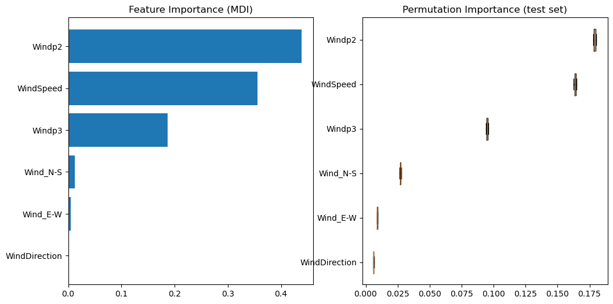

# WindTurbinePrev - Prediction of daily Power Output from 


## Project
This project was developed in an autodidact manner, without external constrain. All suggestion are welcome.

**Aim :** Predict the power output of the wind turbine located in Taggenberg (Winterthur ZH, Switzerland) from the local weather forecast. The model of the wind turbine is Aventa AV 7 (see full characteristics here: https://en.wind-turbine-models.com/turbines/1529-aventa-av-7 )

---

## Dataset
* **Source :** Kaggle, "Wind Turbine SCADA data" by Afroz. Updated in 2024. https://www.kaggle.com/datasets/pythonafroz/wind-turbine-scada-data
* **Volume :** from 2022-01-01 to 2023-07-20, sampled at 1Hz (3.13 GB).
* **Key features :** Datetime, Rotor Speed, Generator Speed, Wind Speed, Wind Direction, Power Output

---

## Methodology

### 1. Data Cleaning & Feature Engineering
* **Outliers detection :**
  * NaN : clean NaN
  * Cut In / Cut Out : Remove data point for a wind speed below 2 m/s and above 14 m/s
  * Turbine stopped : Remove data point with negative power output and with null rotor speed when the wind speed is above 3 m/s
  *  Curtailment : Remove data with power output below 6.2 kW for a wind speed above 6.5 m/s
  * Overheating : Remove data point with a generator temperature above 1000 degrees (arbitrary)

  
* **Creation of new features :**
  * `WindDirection` : The direction of the wind is given with respect to the turbine orientation (Noprth-East). I thus substracted 45 degrees.
  * `Wind_N-S` : Wind speed on the North-South component.
  * `Wind_E-W` : Wind speed on the East-West component.

* **Creation of a new dataframe :** `df_10m` : Resampling from 1 Hz to 10 min.
  * `WindSpeedMax` : Maximal speed during the 10 min sample.
  * `WindSpeedStd` : Standard deviation of the wind speed during the 10 min sample.
  * `Windp2` : wind speed to the power 2 (for a polynomial composition as the power output is sensitive to the wind speed to the power of 2 and 3).
  * `Windp3` : wind speed to the power 3.
  * Cleaning highly turbulent wind (from standard deviation) and NaN

### 2. Modelisation & Performances
* **XGBoost Regressor (Selected) :** Optimized using RandomizedSearchCV. Verified using a cross validation algorithm.

---

## Results & Insights



* **Power of the wind Speed and direction** The power output highly depend on the wind speed to the power of 1, 2 and 3 and to the North-South and East-West components.


---

## Launch project on local

1. **Clone project :**
   ```bash
   git clone [https://github.com/pouillyk/WindTurbinePrev.git](https://github.com/pouillyk/WindTurbinePrev.git)

